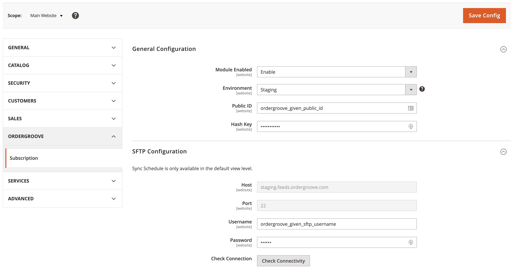
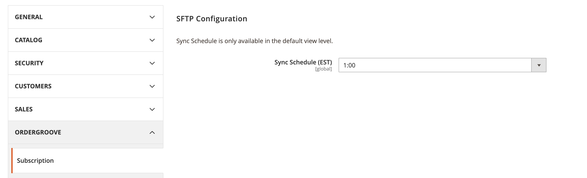

# Overview 

This repository contains a Magento 2 extension which serves as a middleware with Ordergroove's subscription service.

- Compatibility Magento 2.4
    - Adobe Open Source: 2.4.3-p1
    - Adobe Commerce: 2.4.3-p1
    - Use Branches master-24 and develop-24
    - Stable Version -> Latest 1.3.X

# Installation Instructions

Install `Ordergroove/Subscription` through one of the following two methods. After that, configure the module to connect to Ordergroove [as described below](#general-configuration).
## Install through Composer (recommended)

Run the following commands in your root Magento installation directory:
```bash
composer require ordergroove/subscription
bin/magento module:enable Ordergroove_Subscription
bin/magento setup:upgrade
bin/magento cache:flush
```

## Install through app/code (not recommended)
**Note:** When installing through app/code, upgrading the module in the future will be more difficult.

1. Create the following directory: `app/code/Ordergroove/Subscription`
2. Download the [latest release](https://github.com/ordergroove/magento-module) for the module. (You can download previous releases through this link as well)
3. Extract and copy the files to `app/code/Ordergroove/Subscription`.
4. Run the following commands in your root Magento installation directory:
```bash
bin/magento module:enable Ordergroove_Subscription
bin/magento setup:upgrade
bin/magento cache:flush
```

# Documentation

## Configuration

All configuration is located under `Stores > Configuration > Ordergroove > Subscription`.
Configuration is available per website, and will not be visible on the default scope.



###### General Configuration

- **Module Enabled** - Choose whether the module is enabled or not
- **Environment** - Determines whether to use staging urls for **Ordergroove operations only**
- **Public ID** - Ordergroove Public / Merchant ID. Provided by Ordergroove when setting up an account.
    - **Note:** Public ID should be unique for each website, and should _not_ be reused on multiple websites.
- **Hash Key** - Ordergroove Hash Key. Provided by Ordergroove when setting up an account.
    - **Note:** - Hash Key should belong to a corresponding Public ID.

###### SFTP Configuration

- **Sync Schedule** is only available in the Default Config scope.
    - Select the hour of the day (EST) at which the product sync will occur.
    

- **Host** - Un-editable host string. Always points to feeds.ordergroove.com
- **Port** - Un-editable port string. Is always `22`
- **Username** - SFTP Username provided by Ordergroove
- **Password** - SFTP Password provided by Ordergroove
- **Check Connection** - Click after inputting username and password to determine if the credentials are valid.

## Logs

Ordergroove/Subscription will log various important information to log files located within
`var/log/ordergroove`. For example, any product sync related errors will be logged to
`var/log/ordergroove/product_sync/error.log`, and product sync related messages to
`var/log/ordergroove/product_sync/info.log`.

## Recurring Order (Order Placement)

### Placement endpoint configuration

Ordergroove should be configured to send recurring orders to <website_url>/ordergroove/subscription/placeorder

### Enable Flat-rate shipping

The recurring order placement code assumes that flat-rate shipping is enabled. You can enable this feature in Magento via Stores > Configuration > Sales > Delivery Methods


### Enable Multi-Source Inventory

If your store uses multi-store inventory, you must enable this feature in the Ordergroove configuration. You can do this via the standard Ordergroove settings available under Stores > Configuration > Ordergroove > Subscription


